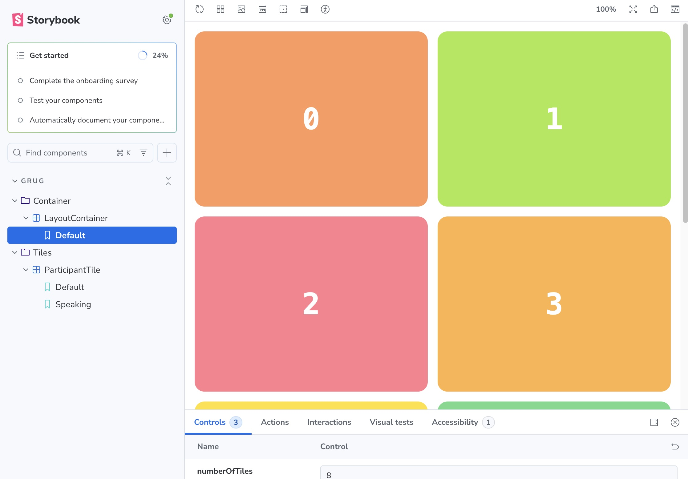

# VoIP Layout POC — Design Hours

This is a proof-of-concept built during the **Design Hours** session of the VoIP team.

## Goal

Explore an architecture for a call layout UI that combines two key ideas:

- **Reactive session model** — the session and its participants are fully observable. State changes (join, leave, mute, speaking…) propagate automatically via RxJS observables.
- **MVVM with compartmented snapshots** — each component has a dedicated ViewModel that subscribes to only the slice of state it cares about and exposes it as a plain snapshot object. The view is a pure function of that snapshot.

## Why this architecture

### Compartmented testing

Because each ViewModel is isolated and exposes a simple snapshot interface, it can be tested independently from the session, the layout engine, or any other component. You can unit-test the snapshot logic without rendering anything.

### Easy Storybook integration

Each component only depends on its ViewModel interface, not on a live session. This makes it trivial to mock the ViewModel in Storybook stories — just feed in a snapshot and the component renders correctly with no setup needed.



### Reactive by default

The session model (`Session`, `Participant`) uses RxJS `BehaviorSubject`s throughout. ViewModels subscribe to the relevant observables and push updates to their snapshot, which triggers a re-render. No polling, no prop drilling.

## Key layers

```
Session (RxJS)
    │
    ├── participants$: BehaviorSubject<Participant[]>
    │       └── per participant: displayName$, isMuted$, isSpeaking$, isVideoEnabled$
    │
    ├── SessionTileProvider
    │       Turns participant join/leave/score events into a ranked TileMetaData[]
    │
    ├── LayoutEngine
    │       Computes pixel positions and sizes for each tile
    │       based on available container size and tile scores
    │
    └── LayoutContainer (React)
            │
            └── ParticipantTileViewModel  (one per tile)
                    Subscribes to the right participant's observables
                    Exposes a PlainTileSnapshot { displayName, isMuted, isSpeaking, … }
                    │
                    └── PlainTile (React)
                            Pure view — renders the snapshot, nothing else
```

## Stack

- React 19 + TypeScript
- RxJS — reactive session model
- Vite — dev server and build
- Storybook — component development and visual testing
- `@vector-im/compound-web` + `@vector-im/compound-design-tokens` — Element design system
